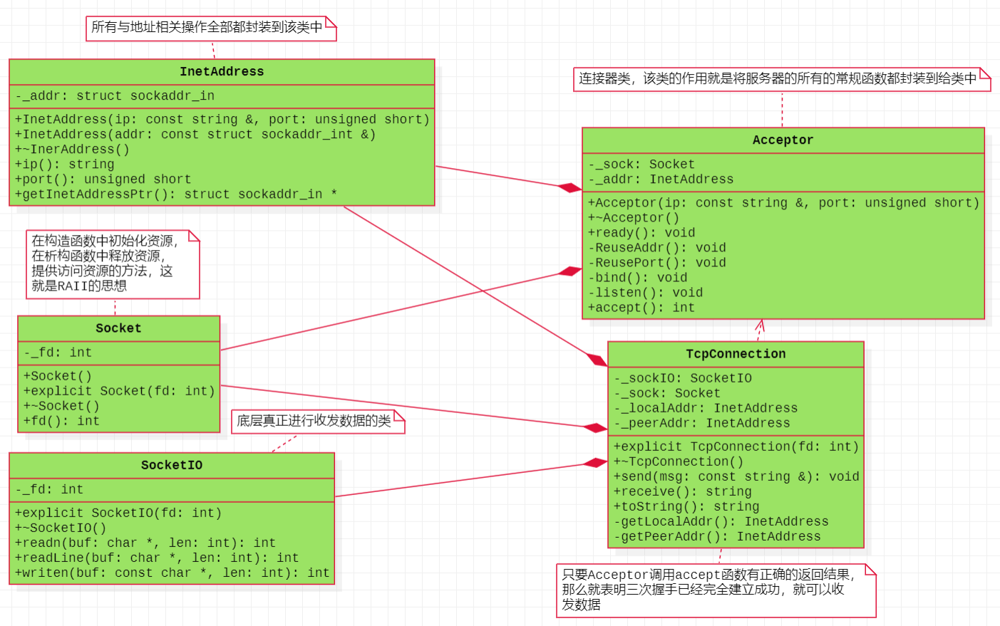
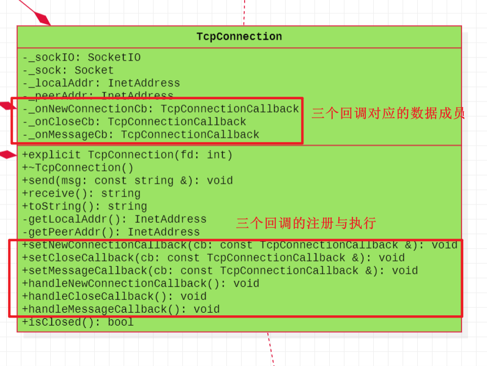
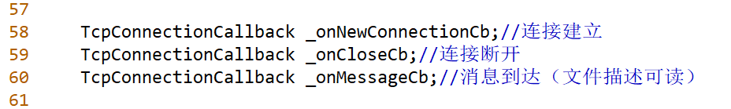
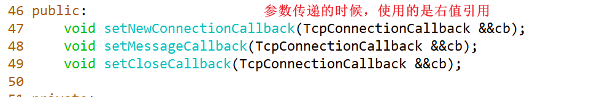
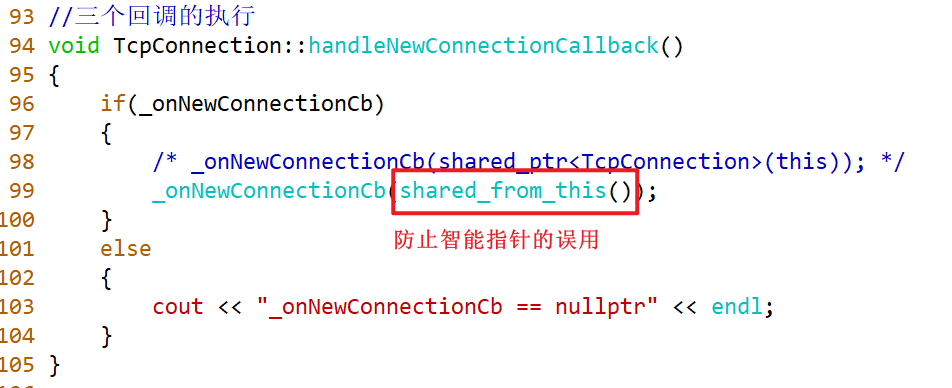
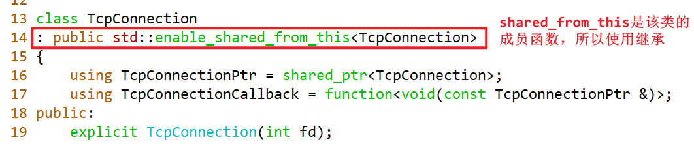
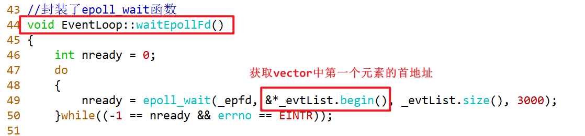
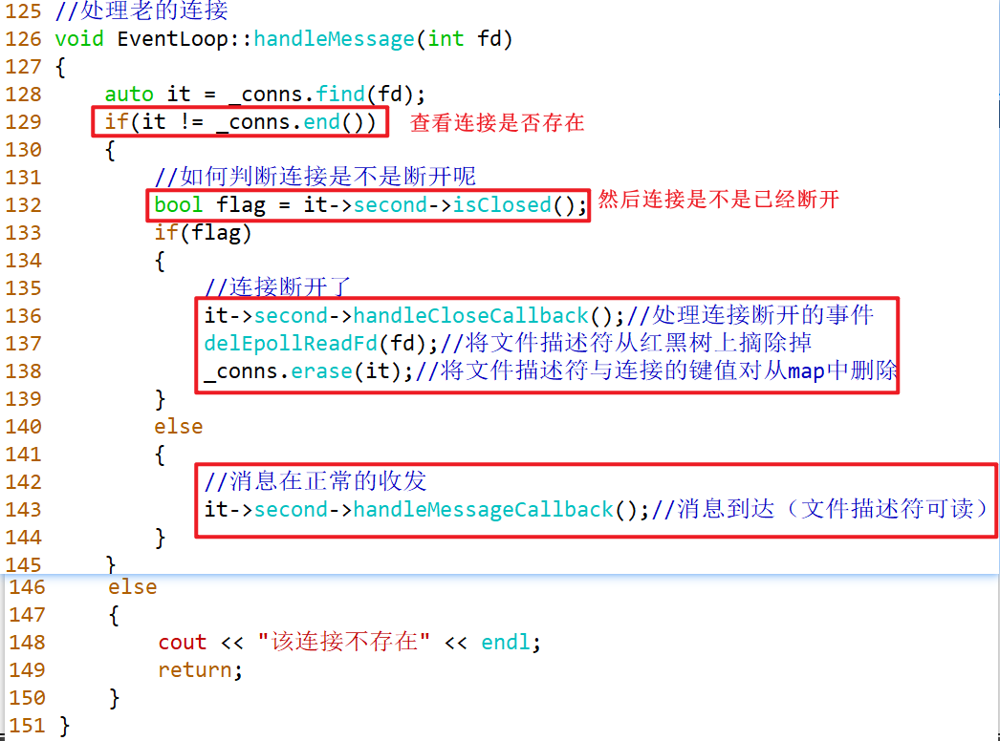
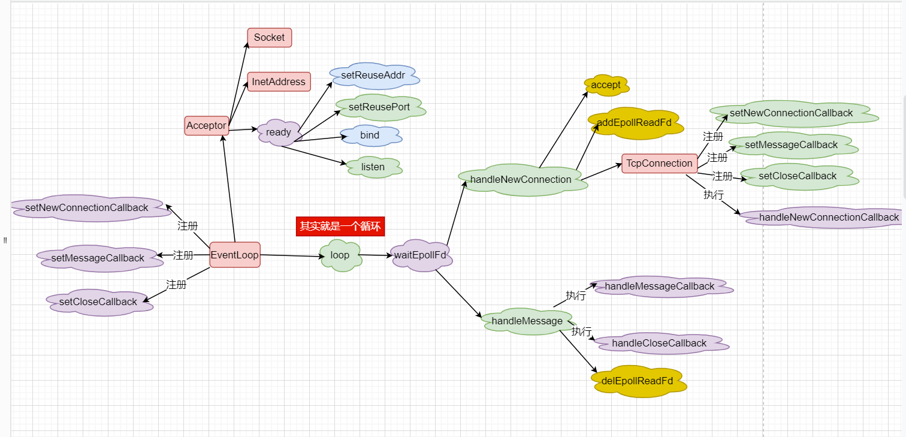

# C++搜索引擎项目

## Reactor

### 一、ReactorV1版本

#### 1、类的设计

Socket类：所有与套接字相关的操作都封装到该类中，包括：使用socket创建文件描述符、使用close关闭文件描述符、以及获取socket的返回结果。

InetAddress类：将所有与地址相关的操作封装到该类中。包括：使用ip与port填充结构体给bind函数进行绑定服务器的ip与端口、可以使用该类获取ip与端口号。可以将struct sockaddr_in的变量作为该类的数据成员。

Acceptor类：该类的作用就是将服务器的所有的常规函数都封装到给类中，让客户端可以进行连接到服务器。包括：地址复用、端口复用、bind、listen、accept函数。

TcpConnection类：只要Acceptor调用accept函数有正确的返回结果，那么就表明三次握手已经完全建立成功，就可以通过该连接进行数据的发送与接受，发送数据可以封装函数send、接受数据可以封装receive函数。

SocketIO类：该类的作用就是为了真正的进行数据的收发，也就是底层会调用相应的读写数据的函数read/recv、write/send。

#### 2、类图的设计



#### 3、常用函数

```C++
ssize_t recv(int sockfd, void *buf, size_t len, int flags);
//如果第四个参数flags为0，那么recv与read是完全等价的。但是如果flags为MSG_PEEK，那么会将内核缓冲区中的数据拷贝出来，而不会移除。

#include <sys/socket.h>
int getsockname(int sockfd, struct sockaddr *addr, socklen_t *addrlen);
//通过文件描述符sockfd获取本端的地址addr

int getpeername(int sockfd, struct sockaddr *addr, socklen_t *addrlen);
//通过文件描述符sockfd获取对端的地址addr
```

### 二、ReactorV2

#### 1、伪代码

```C++
void EventLoop::loop()
{
    _isLooping = true;
    while(_isLooping)
    {
        waitEpollFd();
    }
}

void EventLoop::uploop()
{
    _isLooping = false;
}

void EventLoop::waitEpollFd()
{
    nready = epoll_wait();
    if(-1 == nready && errno == EINTR )
    {
        continue;
    }
    else if(-1 == nready)
    {
        cerr;
        return;
    }
    else if(0 == nready)
    {
        cout << "超时" << endl;
    }
    else
    {
        for(size_t idx = 0; idx < nready; ++idx)
        {
            if(文件描述符 == listenfd)
            {
                //处理新的连接请求
                handleNewConnection();
            }
            else
            {
                //可以老的连接上的数据的收发
                handleMessage();
            }
        }
    }
}

void EventLoop::handleNewConnection()
{
    int connfd = _acceptor.accept();
    
    //将文件描述符connfd放在红黑树上进行监听
    addEpollReadFd(connfd);
    
    //创建出连接
    TcpConnection con(connfd);
    
    //将文件描述符与连接存放在map中
    _conns.insert(connfd, TcpConnection);   
}

void EventLoop::handleMessage(int fd)
{
    auto it = _conns.find(fd);
    if(it != _conns.end())
    {
        //连接是存在的
        //接受数据
        msg = it->second->receive();
        //发送数据
        it->second->send(msg);
    }
    else
    {
        //连接是不存在的
    }
}
```

#### 2、三个半事件

TCP网络编程最本质的是处理三个半事件：

**连接建立**：包括服务器端被动接受连接（accept）和客户端主动发起连接（connect）。TCP连接一旦建立，客户端和服务端就是平等的，可以各自收发数据。
**连接断开**：包括主动断开（close、shutdown）和被动断开（read()返回0）。
**消息到达**：文件描述符可读。这是最为重要的一个事件，对它的处理方式决定了网络编程的风格（阻塞还是非阻塞，如何处理分包，应用层的缓冲如何设计等等）。
消息发送完毕：这算半个。对于低流量的服务，可不必关心这个事件；另外，这里的“发送完毕”是指数据写入操作系统缓冲区（内核缓冲区），将由TCP协议栈负责数据的发送与重传，不代表对方已经接收到数据。

#### 3、类图




#### 4、添加三个半事件（回调）

Tcp网络编程中有三个半事件，但是我们只关注其中的前三个，即：**连接建立、消息到达、连接断开**。三个事件都是与连接相关的，也就是与TcpConnection相关，这三个事件可以使用**回调机制**的形式进行，也就是回调函数的注册与回调函数的执行，但是现在TcpConnection对象的创建在EventLoop中，所以三个事件需要先传递给EventLoop，再交给TcpConnection，而在C++中，回调函数可以使用bind与function结合使用，也就是function可以绑定函数类型，而现在每个事件都与连接相关，所以就是`function<void(const TcpConnectionPtr &)>`,也就是可以将其改名，`using TcpConnectionCallback = function<void(const TcpConnectionPtr &)>`.然后就是EventLoop注册三个回调函数，并且作为桥梁传递给TcpConnection对象，但是EventLoop不会执行该回调函数，因为三个事件的执行只与TcpConnection连接相关，与EventLoop没有关系。最后的结果是，在TcpConnection与EventLoop都注册三个回调函数与设置三个数据成员，但是只有TcpConnection中有三个回调函数的执行。

#### 5、核心代码的解析

##### 5.1、EventLoop中键值对存储


##### 5.2、EventLoop中三个回调的存储



##### 5.3、EventLoop中三个回调的注册



##### 5.4、TcpConnection中三个回调的存储


##### 5.5、TcpConnection中三个回调的注册


##### 5.6、TcpConnection中三个回调的执行





##### 5.7、EventLoop中epoll_wait参数问题



##### 5.8、EventLoop中处理新的连接请求


##### 5.9、EventLoop中老的连接上数据的收发



#### 6、代码流程



### 三、ReactorV3

#### 1、类图


### 四、eventfd的使用

#### 1、特点

它的主要是用于**进程或者线程间**通信(如通知/等待机制的实现)。

#### 2、接口

```C++
#include <sys/eventfd.h>
int eventfd(unsigned int initval, int flags);
//initval:是由内核计数器维护的一个初始值。
//flags:标志位，可以设置为0.也可以是EFD_NONBLOCK或EFD_CLOEXEC
//返回值：返回一个文件描述符，该文件描述符可以进行读写与监听（IO多路复用）
```

#### 3、进程之间进行通信


